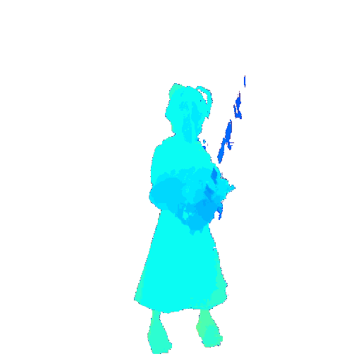
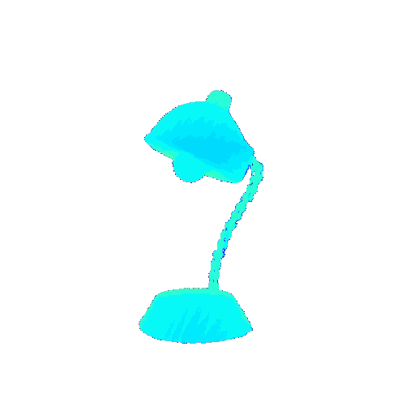
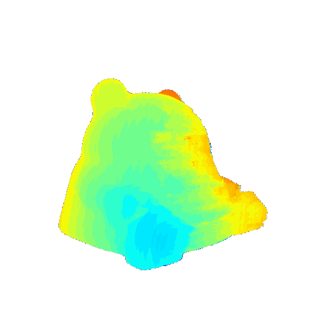
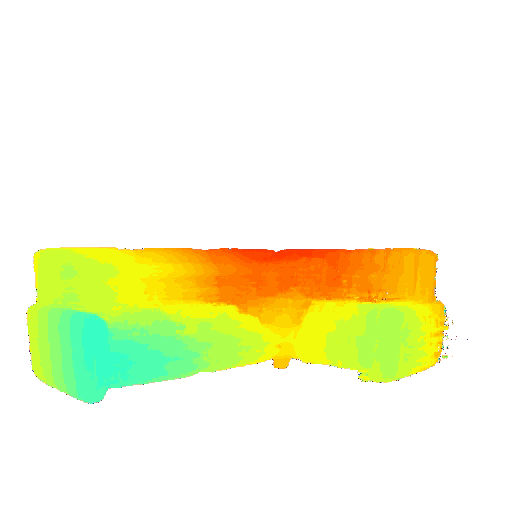
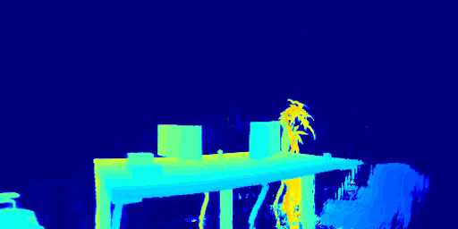
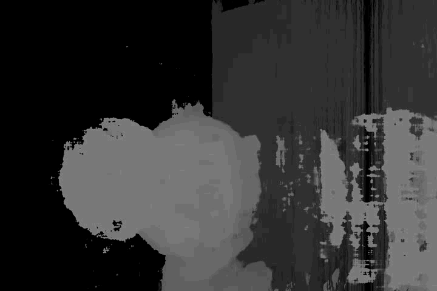
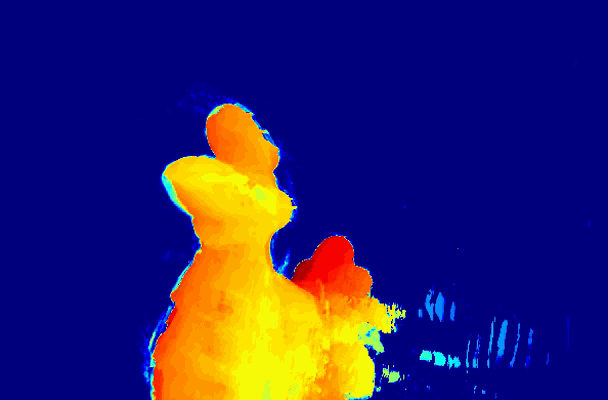
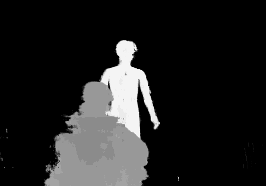
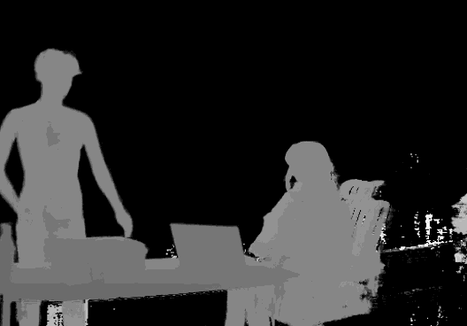

# NeSF: Neural Shadow Field for Two-bounce-NLOS Imaging

## Result

### Simulated Scene
We built a simulation test scenario in Blender and conducted brief trainingand reconstruction on several hidden targets. The figure shows our detailed reconstruction results. For more experimental details, please refer to the first part of the supplementary materials.
<div>




</div>

In addition, we also conducted experiments in complex multi object scenes, and our method stably and efficiently reconstructed all scene details, including the small objects on the table and the leaves of the flower pot.
<div>


</div>


### Real-world Scene
We also placed a target in the real test scenario shown in the figure below, and by obtaining the shadow of the wall, we reconstructed the objects in the hidden scene.
<div>




</div>

We also conducted experiments on multi object and complex scenes in a real room. We set up a real indoor scene and placed two identical models in the room, obtaining the following reconstruction results.
<div>


</div>

## Citation
Our experiment was based on a pytorch implementation of NeRF, and the code reference is as follows.
```
@misc{lin2020nerfpytorch,
  title={NeRF-pytorch},
  author={Yen-Chen, Lin},
  publisher = {GitHub},
  journal = {GitHub repository},
  howpublished={\url{https://github.com/yenchenlin/nerf-pytorch/}},
  year={2020}
}
```